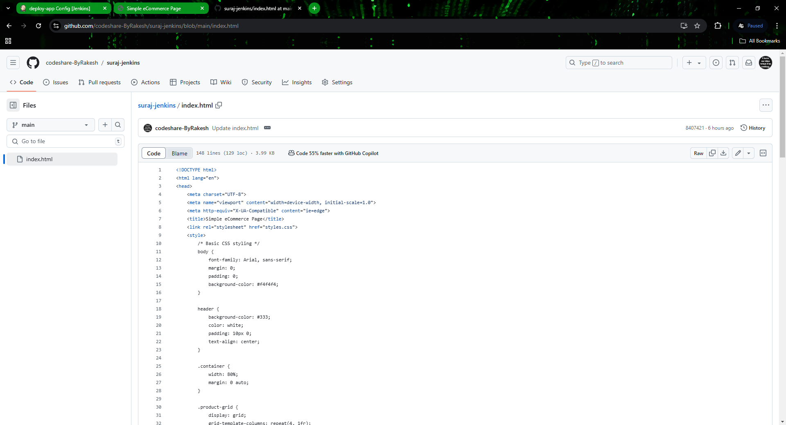

# Implementing Automated Docker Deployment Pipeline Using Jenkins.

### *This guide will walk you through setting up a continuous deployment pipeline that integrates Jenkins, GitHub, and Docker (or Podman) for automated deployment of containerized applications.*

<br>

## Why Use Jenkins for CI/CD?

### Jenkins is a powerful open-source automation server that enables continuous integration (CI) and continuous deployment (CD) of your projects. By setting up a CI/CD pipeline with Jenkins, you automate the process of code testing, Docker image building, and deployment, allowing for faster development cycles and more reliable deployments.

<br>

## Prerequisites
 **Before starting, ensure the following requirements are met:**

1. A Linux server (CentOS/RHEL/UBUNTU , I preferd Rocky Linux of RHEL).
2. Jenkins installed and running on your server.
3. Podman (or Docker) installed for container management.
4. A GitHub repository to push your code.


<br>
<br>

## Follow the below step to implement.
### Step 1: Install Prerequisites
#### 1.1 Install Java (for Jenkins)
- Jenkins requires Java to run. Here, we’ll install Java 17 (openjdk).

```yml
# Update system packages
sudo yum update -y

# Install Java 17 (required by Jenkins)
sudo yum install java-17-openjdk.x86_64 -y

# Verify installation
java -version


```

#### 1.2 Install Jenkins
- Next, install and set up Jenkins to start automatically.

```yml

# Add Jenkins repository and import the key
sudo wget -O /etc/yum.repos.d/jenkins.repo https://pkg.jenkins.io/redhat-stable/jenkins.repo
sudo rpm --import https://pkg.jenkins.io/redhat-stable/jenkins.io-2023.key

# Install Jenkins
sudo yum install jenkins -y

# Reload systemd and start Jenkins
sudo systemctl daemon-reload
sudo systemctl enable jenkins
sudo systemctl start jenkins

# Open Jenkins port in firewall
sudo firewall-cmd --add-port=8080/tcp --permanent
sudo firewall-cmd --reload

# Check if Jenkins is running
sudo systemctl status jenkins


```


#### 1.3 Install Podman (or Docker)
- Install Podman for container management (Docker can also be used).


```yml

# Install Podman
sudo yum install podman -y

# Start and enable Podman service
sudo systemctl start podman
sudo systemctl enable podman
sudo systemctl status podman


```


#### 1.4 Install Git
- Git is essential for pulling code from GitHub.

```yml
# Install Git
sudo yum install git -y

```


### Step 2: Configure Jenkins to Build and Deploy Containers

#### 2.1 Create a Jenkins Job to Pull Code from GitHub
1. Log in to Jenkins by navigating to http: // your-server-ip:8080.

2.  Create a New Freestyle Project:
     - Go to New Item, enter a name (e.g., fetch-code), and select Freestyle Project.

3. Configure Source Code Management:
    - Select Git and add your GitHub repository URL (e.g., https://github.com/username/repository.git).
    - Choose the branch to build (e.g., */main).

4. Configure Build Triggers:

#### OPTION-1
- Select GitHub hook trigger for GITScm polling to automatically trigger this job on GitHub pushes.

<br>

### OPTION-2 
5. Configure Polling with Poll SCM for Changes.
   
*If you prefer using polling instead of webhooks, Jenkins can automatically check for changes in your GitHub repository at regular intervals. Polling allows Jenkins to periodically check the GitHub repository to see if there are updates without waiting for manual intervention.*

### Configure Polling with Poll SCM.

1. Go to your Jenkins job configuration (for fetch-code).

2. In the Build Triggers section, select Poll SCM.

3. Enter the following schedule:

```yml

H/5 * * * *

```

- Explanation of the schedule: This setting triggers the job every 5 minutes, checking if there are new commits in the GitHub repository.
    - H: Jenkins-specific wildcard representing a randomized start within the period.
    - /5: Specifies an interval of 5 minutes.

- Understanding the Polling Mechanism:

   - Polling doesn't constantly monitor GitHub but rather checks at the defined interval. This is useful for detecting new commits without using webhooks.

   - If any changes are found in the GitHub repository, the fetch-code job will start automatically.

### Testing Poll SCM:

- Commit and push a change to your GitHub repository.
- Wait up to 5 minutes, and Jenkins should automatically trigger the fetch-code job if it detects a new commit and update your application as per your push code.

  

6. Add Build Step:
  - Select Execute Shell and add the following to pull the latest code:
```yml

# Navigate to the directory and pull changes
cd /data/jenkins-project/   # Replace with your actual project directory
sudo git pull

```


#### 2.2 Create Jenkins Job to Build Docker Image
1. Create Another Freestyle Project called create_docker_image.

2. Configure Build Triggers:
    - Select Build after other projects are built and specify fetch-code.
3. Add Build Step:
     - Select Execute Shell and add the following commands to build the Docker image:

```yml

# Navigate to the project directory
cd /data/jenkins-project/

# Build Docker image using Podman
sudo podman build -t demo-app .

```
*This command creates a Docker image tagged demo-app using the Dockerfile in the specified directory.*


#### 2.3 Create Jenkins Job to Deploy the Docker Container
1. Create Another Freestyle Project called deploy-app.

2. Configure Build Triggers:
   - Select Build after other projects are built and choose create_docker_image.

3. Add Build Step:

    - Select Execute Shell and add the following to stop the existing container, remove it, and run a new one:

```yml

# Stop and remove existing container if running
sudo podman stop web1 || true  # Ignore error if container is not running
sudo podman rm web1 || true    # Remove container if exists

# Deploy the new container
sudo podman run --name web1 -d -p 80:80 demo-app

```


### Step 4: Test the Pipeline
1. Push a change to your GitHub repository.

2. Observe Jenkins:
  - It will automatically:
    - Trigger fetch-code to pull the latest code.
    - Trigger create_docker_image to build a Docker image from the updated code.
    - Trigger deploy-app to stop the existing container, remove it, and deploy the 
       updated container.


### Step 5: Optional Enhancements
#### 5.1 Email Notifications
- Receive email notifications for build status:

1. Go to Manage Jenkins > Configure System.
2. Configure the SMTP Server and set up E-mail Notification under Post-build Actions in the job configuration.


#### 5.2 Resource Cleanup
- To save disk space, clean up old containers and images regularly:

```yml

# Remove stopped containers and unused images
sudo podman rm $(sudo podman ps -a -q)  # Removes stopped containers
sudo podman rmi $(sudo podman images -q) # Removes unused images

```


<br>
<br>


### Conclusion
#### By implementing this CI/CD pipeline, I’ve gained practical experience in setting up an automated workflow using Jenkins, GitHub, and  Podman. I have learned how to:

- Automate code pulls from GitHub: Using Jenkins jobs and Poll SCM to check for code changes regularly.
- Build and deploy Docker images: Automating the creation and deployment of containerized applications.
- Establish a fully automated, efficient deployment process: Enhancing productivity by reducing manual intervention and ensuring consistency across builds and deployments.

  
*This setup is an excellent foundation for continuous delivery in development and staging environments, promoting faster iteration, reduced error rates, and greater deployment consistency.


<br>
<br>
<br>


## ------------------Screnshots--------------------
1.
<br>
<br>


2.
<br>
<br>


3.
<br>
<br>


<br>
<br>


4.
<br>
<br>


<br>
<br>

5.
<br>
<br>

## -------We pushed our image to the DockerHub-------------


<br>
<br>


<br>
<br>

6.
<br>
<br>

## -------We pushed our image to the DockerHub-------------


<br>
<br>


<br>
<br>

7.
<br>
<br>

## -------We pushed our image to the DockerHub-------------


<br>
<br>


<br>
<br>

8.
<br>
<br>

## -------We pushed our image to the DockerHub-------------


<br>
<br>


<br>
<br>

9.
<br>
<br>

## -------We pushed our image to the DockerHub-------------



<br>
<br>


<br>
<br>

10.   ----Finaly Output When I pushed the code Application is Automatically Updated.
<br>
<br>

## -------We pushed our image to the DockerHub-------------


<br>
<br>


